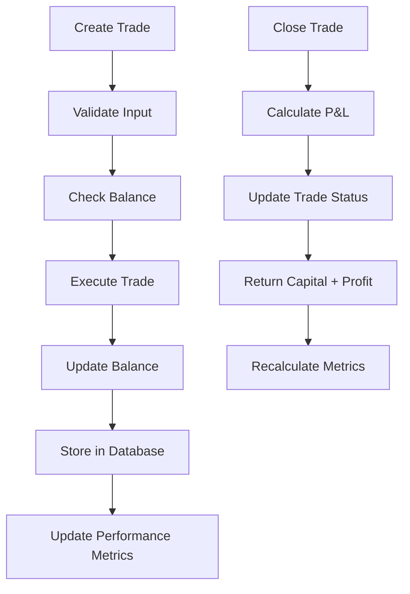
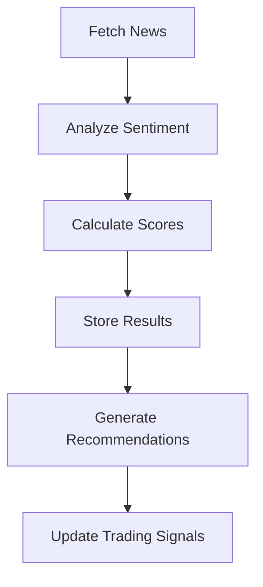
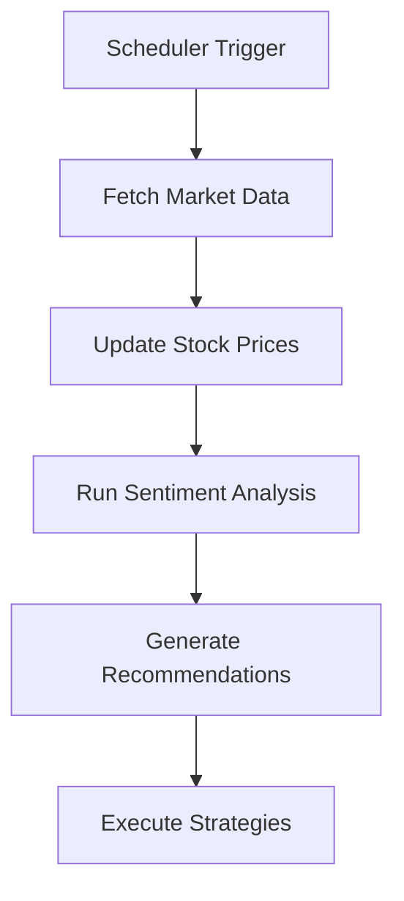

# Database Schema Documentation

This document describes the database schema, models, and relationships for the Trading Platform.

## 📋 Table of Contents

- [Overview](#overview)
- [Database Models](#database-models)
- [Relationships](#relationships)
- [Schema Diagrams](#schema-diagrams)
- [Data Flow](#data-flow)
- [Migration Guide](#migration-guide)
- [Performance Considerations](#performance-considerations)

## 🎯 Overview

The Trading Platform uses SQLAlchemy ORM with support for both SQLite (development) and PostgreSQL (production). The schema is designed to handle paper trading operations, market data storage, sentiment analysis, and portfolio tracking.

### Database Configuration
- **ORM**: SQLAlchemy 1.4+
- **Development**: SQLite (`trading.db`)
- **Production**: PostgreSQL
- **Connection Pooling**: Enabled
- **Auto-commit**: Disabled (explicit transactions)

## 🗄️ Database Models

### Trade Model
**Table**: `trades`  
**Purpose**: Stores all paper trading transactions

```python
class Trade(Base):
    __tablename__ = "trades"
    
    # Primary Key
    id = Column(Integer, primary_key=True, index=True)
    
    # Trade Details
    symbol = Column(String(10), nullable=False, index=True)
    trade_type = Column(String(4), nullable=False)  # "BUY" or "SELL"
    quantity = Column(Integer, nullable=False)
    price = Column(Float, nullable=False)
    total_value = Column(Float, nullable=False)
    
    # Strategy & Metadata  
    strategy = Column(String(50), default="MANUAL")
    sentiment_score = Column(Float, nullable=True)
    
    # Timestamps
    timestamp = Column(DateTime, default=datetime.utcnow, index=True)
    close_timestamp = Column(DateTime, nullable=True)
    
    # Trade Status
    status = Column(String(10), default="OPEN")  # "OPEN" or "CLOSED"
    close_price = Column(Float, nullable=True)
    profit_loss = Column(Float, nullable=True)
```

**Indexes:**
- `ix_trades_id` (Primary)
- `ix_trades_symbol` (Query optimization)
- `ix_trades_timestamp` (Chronological sorting)

**Example Records:**
```sql
INSERT INTO trades (symbol, trade_type, quantity, price, total_value, strategy, timestamp, status)
VALUES 
  ('AAPL', 'BUY', 15, 213.55, 3203.25, 'SENTIMENT_RECOMMENDATION', '2025-07-04 18:47:13', 'CLOSED'),
  ('NVDA', 'BUY', 29, 172.41, 4999.89, 'SENTIMENT', '2025-07-19 17:07:04', 'OPEN');
```

---

### SentimentData Model
**Table**: `sentiment_data`  
**Purpose**: Stores sentiment analysis results for stocks

```python
class SentimentData(Base):
    __tablename__ = "sentiment_data"
    
    # Primary Key
    id = Column(Integer, primary_key=True, index=True)
    
    # Stock Identifier
    symbol = Column(String(10), nullable=False, index=True)
    
    # Sentiment Scores (-1.0 to 1.0)
    overall_sentiment = Column(Float, nullable=False)
    news_sentiment = Column(Float, nullable=True)
    social_sentiment = Column(Float, nullable=True)
    
    # Confidence & Quality Metrics
    confidence_score = Column(Float, default=0.0)
    sources_count = Column(Integer, default=0)
    
    # Analysis Metadata
    analysis_date = Column(Date, default=date.today, index=True)
    timestamp = Column(DateTime, default=datetime.utcnow)
    
    # News Sources Summary
    news_articles_analyzed = Column(Integer, default=0)
    positive_articles = Column(Integer, default=0)
    negative_articles = Column(Integer, default=0)
    neutral_articles = Column(Integer, default=0)
```

**Indexes:**
- `ix_sentiment_data_symbol` (Stock lookups)
- `ix_sentiment_data_analysis_date` (Time-based queries)

**Sample Data:**
```json
{
  "symbol": "AAPL",
  "overall_sentiment": 0.125,
  "news_sentiment": 0.089,
  "social_sentiment": 0.161,
  "confidence_score": 0.75,
  "sources_count": 12,
  "positive_articles": 8,
  "negative_articles": 2,
  "neutral_articles": 2
}
```

---

### StockData Model
**Table**: `stock_data`  
**Purpose**: Stores market data and stock information

```python
class StockData(Base):
    __tablename__ = "stock_data"
    
    # Primary Key
    id = Column(Integer, primary_key=True, index=True)
    
    # Stock Identifier
    symbol = Column(String(10), nullable=False, index=True)
    
    # OHLCV Data
    current_price = Column(Float, nullable=False)
    open_price = Column(Float, nullable=True)
    high_price = Column(Float, nullable=True)
    low_price = Column(Float, nullable=True)
    volume = Column(BigInteger, nullable=True)
    
    # Market Metrics
    market_cap = Column(BigInteger, nullable=True)
    pe_ratio = Column(Float, nullable=True)
    dividend_yield = Column(Float, nullable=True)
    
    # Company Information
    company_name = Column(String(100), nullable=True)
    sector = Column(String(50), nullable=True)
    industry = Column(String(50), nullable=True)
    
    # Timestamps
    timestamp = Column(DateTime, default=datetime.utcnow, index=True)
    data_date = Column(Date, default=date.today, index=True)
```

**Composite Indexes:**
```sql
CREATE INDEX ix_stock_data_symbol_date ON stock_data (symbol, data_date DESC);
```

---

### TradeRecommendation Model
**Table**: `trade_recommendations`  
**Purpose**: AI-generated trading recommendations

```python
class TradeRecommendation(Base):
    __tablename__ = "trade_recommendations"
    
    # Primary Key
    id = Column(Integer, primary_key=True, index=True)
    
    # Recommendation Details
    symbol = Column(String(10), nullable=False, index=True)
    recommendation_type = Column(String(4), nullable=False)  # "BUY", "SELL", "HOLD"
    confidence_score = Column(Float, nullable=False)
    target_price = Column(Float, nullable=True)
    
    # Analysis & Reasoning
    reasoning = Column(Text, nullable=True)
    sentiment_score = Column(Float, nullable=True)
    technical_score = Column(Float, nullable=True)
    
    # Status Tracking
    status = Column(String(20), default="PENDING")  # "PENDING", "APPROVED", "REJECTED", "EXECUTED"
    priority = Column(String(10), default="MEDIUM")  # "HIGH", "MEDIUM", "LOW"
    
    # Timestamps
    created_at = Column(DateTime, default=datetime.utcnow, index=True)
    executed_at = Column(DateTime, nullable=True)
    
    # Execution Results
    execution_price = Column(Float, nullable=True)
    trade_id = Column(Integer, ForeignKey("trades.id"), nullable=True)
```

**Foreign Keys:**
- `trade_id` → `trades.id` (Optional link to executed trade)

---

### PerformanceMetrics Model
**Table**: `performance_metrics`  
**Purpose**: Cached portfolio performance calculations

```python
class PerformanceMetrics(Base):
    __tablename__ = "performance_metrics"
    
    # Primary Key
    id = Column(Integer, primary_key=True, index=True)
    
    # Portfolio Metrics
    total_trades = Column(Integer, default=0)
    winning_trades = Column(Integer, default=0)
    losing_trades = Column(Integer, default=0)
    
    # Financial Metrics
    total_profit_loss = Column(Float, default=0.0)
    current_balance = Column(Float, nullable=False)
    max_drawdown = Column(Float, default=0.0)
    
    # Performance Ratios
    win_rate = Column(Float, default=0.0)
    sharpe_ratio = Column(Float, default=0.0)
    total_return = Column(Float, default=0.0)
    
    # Time Periods
    calculation_date = Column(Date, default=date.today, index=True)
    period_start = Column(Date, nullable=True)
    period_end = Column(Date, nullable=True)
    
    # Metadata
    timestamp = Column(DateTime, default=datetime.utcnow)
```

## 🔗 Relationships

### Entity Relationship Diagram
```
┌─────────────────┐       ┌─────────────────┐
│     Trade       │   ┌──▶│ TradeRecommend  │
│                 │   │   │                 │
│ ├─ id (PK)      │   │   │ ├─ id (PK)      │
│ ├─ symbol       │───┤   │ ├─ symbol       │
│ ├─ trade_type   │   │   │ ├─ trade_id (FK)│
│ ├─ quantity     │   │   └─────────────────┘
│ ├─ price        │   │
│ ├─ profit_loss  │   │   ┌─────────────────┐
│ └─ status       │   └──▶│ SentimentData   │
└─────────────────┘       │                 │
                          │ ├─ id (PK)      │
┌─────────────────┐       │ ├─ symbol       │
│   StockData     │───────┤ ├─ sentiment    │
│                 │       │ └─ confidence   │
│ ├─ id (PK)      │       └─────────────────┘
│ ├─ symbol       │
│ ├─ current_price│       ┌─────────────────┐
│ ├─ market_cap   │       │ PerformanceMetr │
│ └─ volume       │       │                 │
└─────────────────┘       │ ├─ id (PK)      │
                          │ ├─ total_trades │
                          │ ├─ win_rate     │
                          │ └─ total_return │
                          └─────────────────┘
```

### Relationship Details

1. **Trade ↔ TradeRecommendation**
   - One recommendation can generate one trade
   - One trade can optionally link back to its recommendation

2. **Symbol-based Relationships**
   - All models with `symbol` field are logically related
   - No explicit foreign keys (performance optimization)
   - Queries join on symbol matching

3. **Time-based Relationships**
   - Models linked by date/timestamp for historical analysis
   - Performance metrics calculated from trade history

## 📊 Schema Diagrams

### Database Schema SQL
```sql
-- Core Tables Creation
CREATE TABLE trades (
    id INTEGER PRIMARY KEY AUTOINCREMENT,
    symbol VARCHAR(10) NOT NULL,
    trade_type VARCHAR(4) NOT NULL CHECK (trade_type IN ('BUY', 'SELL')),
    quantity INTEGER NOT NULL CHECK (quantity > 0),
    price REAL NOT NULL CHECK (price > 0),
    total_value REAL NOT NULL,
    strategy VARCHAR(50) DEFAULT 'MANUAL',
    sentiment_score REAL,
    timestamp DATETIME DEFAULT CURRENT_TIMESTAMP,
    close_timestamp DATETIME,
    status VARCHAR(10) DEFAULT 'OPEN' CHECK (status IN ('OPEN', 'CLOSED')),
    close_price REAL,
    profit_loss REAL
);

CREATE TABLE sentiment_data (
    id INTEGER PRIMARY KEY AUTOINCREMENT,
    symbol VARCHAR(10) NOT NULL,
    overall_sentiment REAL NOT NULL CHECK (overall_sentiment BETWEEN -1.0 AND 1.0),
    news_sentiment REAL CHECK (news_sentiment BETWEEN -1.0 AND 1.0),
    social_sentiment REAL CHECK (social_sentiment BETWEEN -1.0 AND 1.0),
    confidence_score REAL DEFAULT 0.0 CHECK (confidence_score BETWEEN 0.0 AND 1.0),
    sources_count INTEGER DEFAULT 0,
    analysis_date DATE DEFAULT CURRENT_DATE,
    timestamp DATETIME DEFAULT CURRENT_TIMESTAMP,
    news_articles_analyzed INTEGER DEFAULT 0,
    positive_articles INTEGER DEFAULT 0,
    negative_articles INTEGER DEFAULT 0,
    neutral_articles INTEGER DEFAULT 0
);

-- Indexes for Performance
CREATE INDEX ix_trades_symbol ON trades (symbol);
CREATE INDEX ix_trades_timestamp ON trades (timestamp DESC);
CREATE INDEX ix_sentiment_data_symbol ON sentiment_data (symbol);
CREATE INDEX ix_sentiment_data_date ON sentiment_data (analysis_date DESC);
CREATE INDEX ix_stock_data_symbol_date ON stock_data (symbol, data_date DESC);
```

## 🔄 Data Flow

### Trading Workflow


### Sentiment Analysis Flow


### Data Collection Flow


## 🚀 Migration Guide

### Initial Database Setup
```python
# Create all tables
from database import Base, engine
Base.metadata.create_all(bind=engine)
```

### Adding New Columns (Example)
```python
# Migration: Add new column to Trade model
from alembic import op
import sqlalchemy as sa

def upgrade():
    op.add_column('trades', 
        sa.Column('risk_score', sa.Float, nullable=True))

def downgrade():
    op.drop_column('trades', 'risk_score')
```

### Data Migration Scripts
```python
# Migrate existing data
def migrate_trade_strategies():
    """Update strategy field for existing trades"""
    db = SessionLocal()
    try:
        trades = db.query(Trade).filter(Trade.strategy.is_(None)).all()
        for trade in trades:
            trade.strategy = "MANUAL"  # Default value
        db.commit()
    finally:
        db.close()
```

## ⚡ Performance Considerations

### Query Optimization

#### Indexes
```sql
-- Critical indexes for performance
CREATE INDEX ix_trades_symbol_status ON trades (symbol, status);
CREATE INDEX ix_trades_timestamp_desc ON trades (timestamp DESC);
CREATE INDEX ix_sentiment_symbol_date ON sentiment_data (symbol, analysis_date DESC);
```

#### Efficient Queries
```python
# Good: Use indexes
trades = db.query(Trade).filter(
    Trade.symbol == "AAPL",
    Trade.status == "OPEN"
).order_by(Trade.timestamp.desc()).limit(10)

# Bad: No index utilization
trades = db.query(Trade).filter(
    func.lower(Trade.symbol) == "aapl"  # Function prevents index use
)
```

### Connection Pooling
```python
# Database configuration for production
engine = create_engine(
    DATABASE_URL,
    pool_size=20,
    max_overflow=0,
    pool_pre_ping=True,
    echo=False
)
```

### Batch Operations
```python
# Efficient bulk insert
def bulk_insert_sentiment_data(sentiment_records):
    db = SessionLocal()
    try:
        db.bulk_insert_mappings(SentimentData, sentiment_records)
        db.commit()
    finally:
        db.close()
```

### Query Patterns

#### Portfolio Performance Calculation
```python
def get_portfolio_metrics(db: Session) -> Dict:
    # Efficient aggregate query
    closed_trades = db.query(
        func.count(Trade.id).label('total_trades'),
        func.sum(Trade.profit_loss).label('total_pnl'),
        func.count(case([(Trade.profit_loss > 0, 1)])).label('winning_trades')
    ).filter(Trade.status == "CLOSED").first()
    
    return {
        'total_trades': closed_trades.total_trades or 0,
        'total_profit_loss': closed_trades.total_pnl or 0.0,
        'winning_trades': closed_trades.winning_trades or 0
    }
```

#### Recent Activity Query
```python
def get_recent_trades(db: Session, limit: int = 10) -> List[Trade]:
    return db.query(Trade)\
        .order_by(Trade.timestamp.desc())\
        .limit(limit)\
        .all()
```

### Database Maintenance

#### Regular Cleanup
```python
def cleanup_old_data(days_to_keep: int = 90):
    """Remove old sentiment data to prevent bloat"""
    cutoff_date = date.today() - timedelta(days=days_to_keep)
    
    db = SessionLocal()
    try:
        deleted = db.query(SentimentData)\
            .filter(SentimentData.analysis_date < cutoff_date)\
            .delete()
        db.commit()
        print(f"Deleted {deleted} old sentiment records")
    finally:
        db.close()
```

#### Performance Analysis
```sql
-- SQLite: Query performance analysis
EXPLAIN QUERY PLAN 
SELECT * FROM trades 
WHERE symbol = 'AAPL' AND status = 'OPEN' 
ORDER BY timestamp DESC;
```

---

## 🔧 Troubleshooting

### Common Database Issues

1. **Database Locked (SQLite)**
   ```python
   # Solution: Proper connection management
   db = SessionLocal()
   try:
       # Database operations
       db.commit()
   except Exception as e:
       db.rollback()
       raise
   finally:
       db.close()
   ```

2. **Performance Issues**
   ```sql
   -- Check missing indexes
   PRAGMA index_list('trades');
   PRAGMA index_info('ix_trades_symbol');
   ```

3. **Data Integrity Issues**
   ```python
   # Add validation constraints
   @validates('quantity')
   def validate_quantity(self, key, quantity):
       if quantity <= 0:
           raise ValueError("Quantity must be positive")
       return quantity
   ```

### Database Reset
```bash
# Complete database reset (development)
rm backend/trading.db
cd backend
python -c "from database import Base, engine; Base.metadata.create_all(bind=engine)"
```

---

For additional database questions, refer to the SQLAlchemy documentation or the main project documentation.